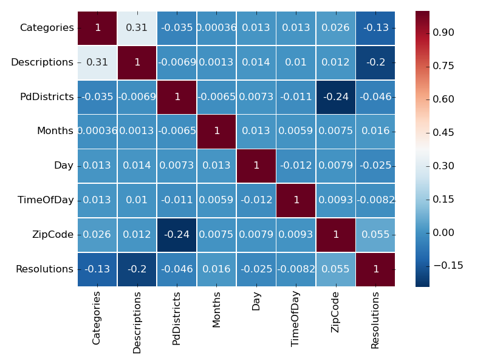

# <b>San Francisco Crime Predictor</b>

<b>Contributors</b>

Ben Kirton

Chris Ritter

David Phipps

Ines Toledo Bordiu

Lizett Rincon

William Davis

## Table of Contents
- [Selected Topic](https://github.com/noops/sanFranCrimePredictor/tree/lizett_rincon#selected-topic)
- [Source of Data](https://github.com/noops/sanFranCrimePredictor/tree/lizett_rincon#source-of-data)
- [Goals](https://github.com/noops/sanFranCrimePredictor/tree/lizett_rincon#goals)
- [Data Exploration](https://github.com/noops/sanFranCrimePredictor/tree/lizett_rincon#data-exploration)
- [Machine Learning Analysis](https://github.com/noops/sanFranCrimePredictor/tree/lizett_rincon#machine-learning-analysis)
- [Model Selection](https://github.com/noops/sanFranCrimePredictor/tree/lizett_rincon#model-selection)
- [Dashboard](https://github.com/noops/sanFranCrimePredictor/tree/lizett_rincon#dashboard)
- [Technologies Used](https://github.com/noops/sanFranCrimePredictor/tree/lizett_rincon#technologies-used)
- [Links](https://github.com/noops/sanFranCrimePredictor/tree/lizett_rincon#links)

## Selected Topic
Our group selected the San Francisco Crime Dataset for the following reasons:
1. The data is clear and easy to understand. 
2. The data is large enough to support different predictions.
3. Data visualizations can be easily produced.

## Source of Data
We obtained the data from Kaggle [San Francisco Crime Dataset](https://www.kaggle.com/roshansharma/sanfranciso-crime-dataset). 
- It contains 13 columns and 150,500 rows
- The data provides information such as the day, time, location, description, resolution, etc. of the crimes reported.

## Goals
Our goal is to analyze the data and determine:
1. The top crime categories.
2. Determine the resolution outcomes.
3. Analyze the date, time and location per crime.
4. Finally, use a Machine Learning Model in order to try and predict the resolution outcomes based on the data we have.
- Can we predict whether or not a person will be <b>arrested and booked</b> based on the data provided?
- If so, how <b>reliable</b> is the data?

## Data Exploration
The following graphs show some of the initial data exploration of our analysis:

### Crime Category Counts

### Top 10 Crime Descriptions

### SF PD Districts

### Daily Crime Rates

## Machine Learning Analysis
- Our group decided that the <b>Resolution</b> column would be our dependant variable for our machine learning analysis (aka label). Since we wanted to create a binary classifier, we dropped the ‘Other’ resolution from our data as it represented only 2.2% of the crimes.

### Pearson Correlation Matrix
The Pearson Correlation Matrix helped us determine which features had the highest correlation with our label.

### Principal Component Analysis (PCA)
We used PCA in order to speed up the machine learning algorithms by reducing the number of features from 63 to 50, while still capturing 97% of the variance.

### Model Testing
Balance Accuracy Score Results

| ML Model      | Results|
| :---        |    :----: |
| Random Forest      | 98.92%  |   
| AdaBoost  | 90.83%   |   
| Decision Tree      | 98.11%  |   
| Gaussian Naive Bayes  | 82.32%   |   
| Gradient Boost     | 94.92%  |     

## Model Selection
Our group decided to use the Random Forest Classifier for our crime resolution prediction analysis for two reasons:
1. Random Forest Classifiers are robust to overfitting, can handle thousands of input variables without variable decision and run efficiently on large datasets. In addition to that, Random Forests handle categorical data well and run quickly. 
2. After testing several machine learning models, we selected the Random Forest Classifier as it returned the highest accuracy score before and after Principal Component Analysis at the highest speed.

## Dashboard
Once our model was selected, we applied it to our dashboard in order to have an interactive element. 
1. Drop-down menu in order to select inputs: 
- Weekday
- Time of Day
- Police District
- Crime Category and
- Zip Code

2. A "Predict" button that will run the machine learning model to test the parameters created from the input selections.

3. Output visual that will display the results of the machine learning model. Will you be arrested and booked based on the inputs selected? Displayed results will show in the following format:

- <b>If Arrested and Booked:</b>
YOU'VE MOST LIKELY BEEN ARRESTED
- <b>If Not Arrested:</b>
YOU'VE COMMITED A CRIME AND GOTTEN AWAY

## Technologies Used
- Docker Documentation
- GitHub
- JavaScript
- Jupyter Notebook
- Matplotlib
- Pandas
- PosgreSQL
- Python
- Scikit-learn
- SQLAlchemy

## Links
#### [San Francisco Crime Dataset](https://www.kaggle.com/roshansharma/sanfranciso-crime-dataset)
#### [Google Slides](https://docs.google.com/presentation/d/15_He1YvD366ukodzkfbG418iSVmOcC6Re9f0O5FfMeI/edit#slide=id.ga64223047d_0_0)
#### [Dashboard](http://167.99.27.90/)
