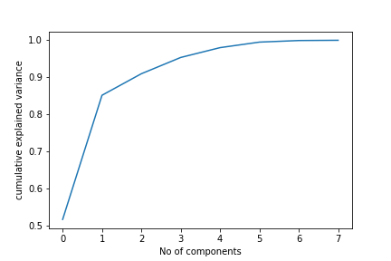
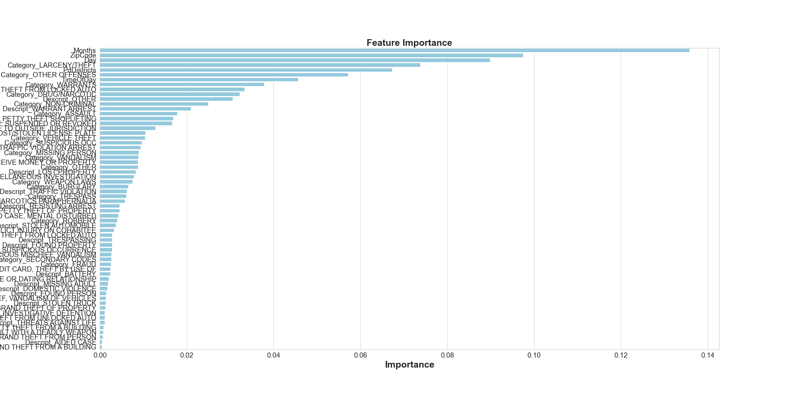

## Data Preprocessing

description of preliminary data preprocessing with images

Our dataset consists of 150,500 rows with 13 columns. A separate dataframe was created containing all of the location data as it is not needed for the initial machine learning model. Columns that will not affect the machine learning model such as "PdId", and "IncidntId" are dropped from the dataset completely. The remaining columns are "Category", "PdDistrict", and "Resolution". These columns make up the cleaned dataframe that will be used with the preliminary machine learning models. Several different models will be tested to find the best balance of accuracy scores and speed. This is a supervised machine learning problem focusing on classification. The dataset is labeled, and there is a clear binary outcome we can predict with our features. The resolution column is our target column. It contains 14 unique values. Analysis revealed that out of those 150,500 columns only 3,304 contained resolutions other than "ARREST, BOOKED" and "NONE". Making up just 2% of the dataset, these other values were bucketed and dropped.

## Feature Engineering

description of preliminary feature engineering, selection, and decision making process

Since our dataset consists primarily of non-ordinal categorical variables sci-kit learn onehotencoder is the best choice for our variable encoding. The onehotencoder is a good choice for a tree based model because the result is binary rather than ordinal, and everything sits in orthogonal vector space. A downside of the onehotencoder is that it can create a large number of features resulting in the curse of dimensionality. This can be averted by employing principal component analysis (PCA) after encoding categorical variables.

 PCA is a feature extraction method used to speed up machine learning algorithms when the number of features is too high. It allows us to reduce the dimensions of our dataset when we are not able to identify features to completely remove from consideration.  

## Training and Testing Sets

description of how data was split into training and testing sets

Since almost 60% of the resolutions are "NONE" randomly selecting a resolution gives a pretty good chance of selecting "NONE". In order to better utilize the models our training split is 50% of the data. The remaining 50% is split into 25% testing data and 25% validation data. This allows us to use train our model and use the validation data to check the accuracy score. In addition to this another accuracy gauge is the precision score for arrest, booked since approximately 60% of the resoultions are "NONE". 

## Explanation of model choice

ML model comparisons 

Random forests are robust to overfitting, can handle thousands of input variables without variable decision, and run efficiently on large datasets. In addition to that random forests handle categorical data well, and run quickly. We tested an ada-boost classifier, easy ensemble classifier, support vector machine, and a random forest. Out of those machine learning models, the random forest returned close to the highest initial accuracy score, and it ran the fastest. 

This graph shows the feature selection of our baseline random forest model. Not suprisingly the most common crimes committed in the San Francisco area are weighted the most heavily. Approximately 26% of all recorded crimes are larceny/theft. The district with the heaviest weight is the Tenderlion district. Approximately 43% of crimes committed in this district result in an arrest. The Mission and Southern districts are the next highest weighted, and they too have a high percentage of arrests for crimes committed. This graph shows that the model is doing a good job weighing important features. 