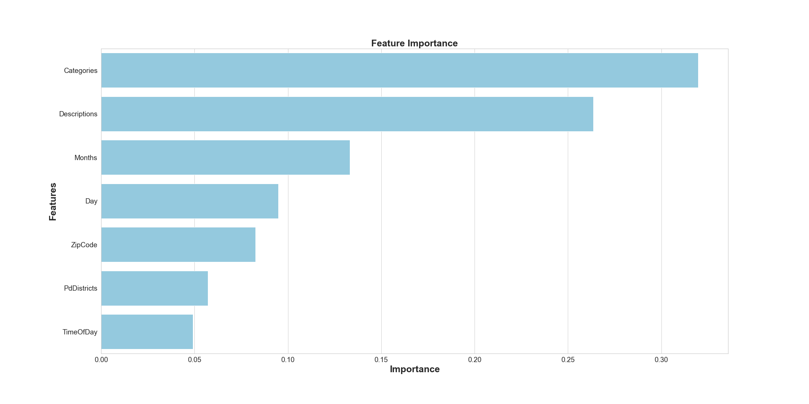
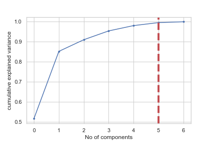

## Data Preprocessing

description of preliminary data preprocessing with images

Our dataset consists of 150,500 rows with 13 columns. A separate dataframe was created containing all of the location data as it is not needed for the initial machine learning model. Columns that will not affect the machine learning model such as "PdId", and "IncidntId" are dropped from the dataset completely. The remaining columns are Category, PdDistrict, Resolution, Month, Time of Day, Zipcode, and Description. These columns make up the cleaned dataframe that will be used with the preliminary machine learning models. Several different models will be tested to find the best balance of accuracy scores and speed. This is a supervised machine learning problem focusing on classification. The dataset is labeled, and there is a clear binary outcome we can predict with our features. The resolution column is our target column. It contains 14 unique values. Analysis revealed that out of those 150,500 columns only 3,304 contained resolutions other than "ARREST, BOOKED" and "NONE". Making up just 2% of the dataset, these other values were bucketed and dropped.

## Feature Engineering

description of preliminary feature engineering, selection, and decision making process

Since our dataset consists primarily of non-ordinal categorical variables sci-kit learn onehotencoder is the best choice for our variable encoding. The onehotencoder is a good choice for a tree based model because the result is binary rather than ordinal, and everything sits in orthogonal vector space. In addition to encoding, the data is scaled using sci-kit learn StandardScaler. This decision was made after realizing that the zipcodes need to be included for the ML model. The zipcodes are much larger than the rest of our encoded data, which was primarily 1's and 0's. A downside of the onehotencoder is that it can create a large number of features resulting in the curse of dimensionality. This can be averted by employing principal component analysis (PCA) after encoding categorical variables. After PCA we were able to reduce our features from 63 down to 50, while still capturing 97% of the variance. The results from our random forest using this model resulted in an accuracy score of 98%. 

## Training and Testing Sets

description of how data was split into training and testing sets

Since almost 60% of the resolutions are "NONE" randomly selecting a resolution gives a pretty good chance of selecting "NONE". In order to better utilize the model our training split is 50% of the data. The remaining 50% is split into 25% testing data and 25% validation data. This was done within our testing notebooks. The model used for the interactive dashboard splits into 50% training and 50% testing sets. 

## Explanation of model choice

ML model comparisons 

Random forests are robust to overfitting, can handle thousands of input variables without variable decision, and run efficiently on large datasets. In addition to that random forests handle categorical data well, and run quickly. We tested an ada-boost classifier, easy ensemble classifier, support vector machine, and a random forest. Out of those machine learning models, the random forest returned close to the highest initial accuracy score, and it ran the fastest. The graph below shows the feature ranking in the baseline model which used default parameters. 

## Changes in model

 After creating our interactive dashboard where the user is allowed to select features and receive a prediction from our model a value error was encountered. Using the principal components, our model was trained on 50 features, but we are only allowing the user to select 5 features. In order to get around this value error, we could fill the dataframe created from the user input with 45 columns containing 0. This would cause accuracy issues so another solution was needed. In order to achieve the best accuracy score the model needs to be trained on as much available data as possible. Our categorical variables were encoded ordinally to ensure that a lower number of features was used for training.

 After going back to the drawing board we realized that our initial random forest model is likely overfitting the data because of the curse of dimensionality resulting from how the data was encoded and standardized. The new model uses principal component analysis and hypertuned parameters using techniques gathered from https://towardsdatascience.com/optimizing-hyperparameters-in-random-forest-classification-ec7741f9d3f6. 

 This graph shows our re-worked principal component analysis after making changes in how our variables were encoded. The model needs to be trained on the same number of features that users will be selecting for predictions.  

## Confusion matrix and accuracy score

            Predicted 0  Predicted 1

    Actual 0:  16927        2716 
    Actual 1:  9714         44241   

balanced accuracy score = 84.08%

imbalanced classification report

            pre       rec       spe        f1       geo       iba       sup

    0       0.64      0.86      0.82      0.73      0.84      0.71     19643

    1       0.94      0.82      0.86      0.88      0.84      0.70     53955

